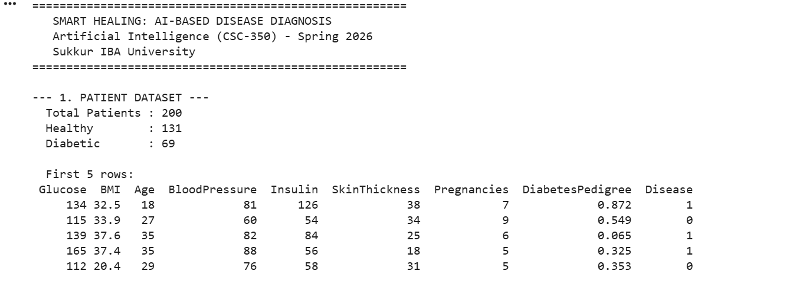
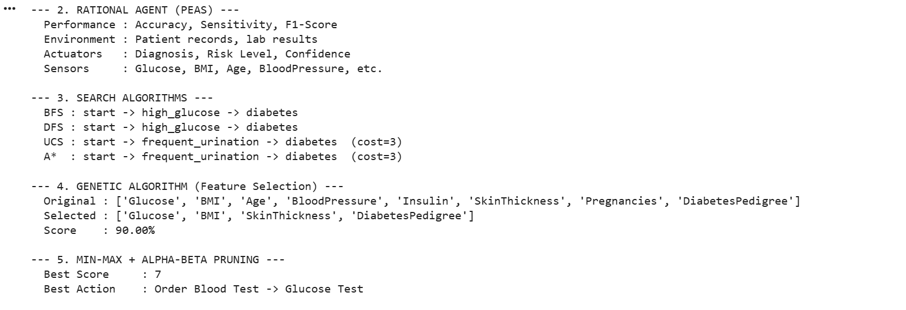
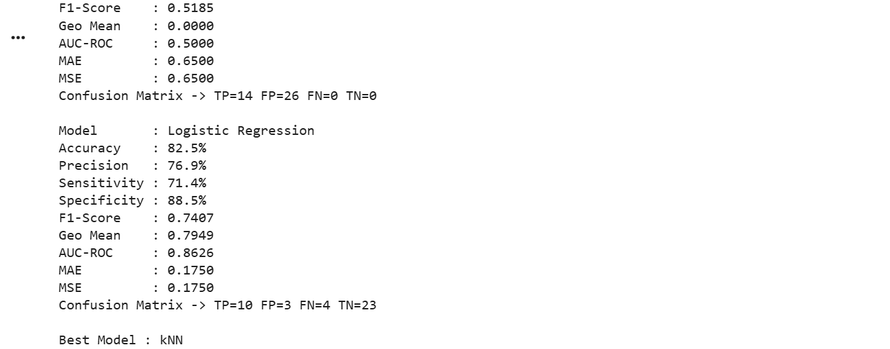

# Smart Healing — AI-Based Disease Diagnosis System

A comprehensive AI pipeline for predicting diabetes from clinical patient data. The system integrates symbolic AI, evolutionary computation, game-tree reasoning, supervised machine learning, and unsupervised clustering into a unified diagnostic pipeline modelled as a PEAS rational agent.

Built as part of the Artificial Intelligence course (CSC-350), Spring 2026, Sukkur IBA University.

---

## Results

| Model | Accuracy | Precision | F1-Score | AUC-ROC |
|---|---|---|---|---|
| kNN (k=7) | **87.5%** | 84.6% | 0.8148 | 0.8819 |
| Logistic Regression | 82.5% | 76.9% | 0.7407 | 0.8626 |
| Decision Tree | 35.0% | 35.0% | 0.5185 | 0.5000 |

**Best Model:** kNN — 87.5% accuracy, AUC-ROC of 0.8819

**5-Fold Cross-Validation:** Mean accuracy 76.88% ± 7.02%

---

## AI Techniques Used

- **Rational Agent (PEAS Framework)** — Models the system as a rational agent with Performance, Environment, Actuators, and Sensors
- **Graph Search Algorithms** — BFS, DFS, UCS, and A* for symptom-to-diagnosis reasoning over a weighted directed graph
- **Genetic Algorithm** — Binary GA for feature selection; selected Glucose, BMI, SkinThickness, DiabetesPedigree as optimal subset
- **Minimax + Alpha-Beta Pruning** — Game-tree reasoning for clinical test-ordering decisions
- **K-Nearest Neighbors (k=7)** — Best performing classifier; 87.5% accuracy
- **Decision Tree (CART)** — Interpretable rules with Gini-based feature importance
- **Logistic Regression** — Best AUC-ROC (0.8626); calibrated probabilities for risk thresholding
- **K-Means Clustering (k=2)** — Unsupervised patient stratification into Low-Risk and High-Risk groups
- **5-Fold Cross-Validation** — Confirms model generalisation and rules out overfitting

- ---

## Dataset

- **Type:** Synthetic dataset generated with NumPy (seed=42)
- **Size:** 200 patients, 8 clinical features
- **Features:** Glucose, BMI, Age, BloodPressure, Insulin, SkinThickness, Pregnancies, DiabetesPedigree
- **Labels:** 131 Healthy, 69 Diabetic (~35% positive cases)
- **File:** `smart_healing_dataset.csv`

---

## Project Structure

    01-smart-healing/
    ├── AI_Semester_Project.ipynb            # Main notebook (clean version)
    ├── AI_Semester_Project_With_Comments.ipynb  # Commented version for understanding
    ├── smart_healing_dataset.csv            # Synthetic patient dataset
    ├── SmartHealing_IEEE_Report.pdf         # Full IEEE-format research report
    ├── outputs/                             # Sample output screenshots
    │   ├── Output1.png
    │   ├── Output2.png
    │   ├── Output3.png
    │   ├── Output4.png
    │   ├── Output5.png
    │   ├── Output6.png
    │   └── Output7.png
    └── README.md

---

## How to Run

### Requirements
- Python 3.10+
- Jupyter Notebook or JupyterLab

### Installation

pip install numpy pandas scikit-learn matplotlib seaborn jupyter

### Steps
1. Clone or download the repository
2. Open `AI_Semester_Project.ipynb` in Jupyter Notebook
3. Run all cells from top to bottom

---

## Sample Outputs

---

## Team

| Name | University |
|---|---|
| Abdul Manan | Sukkur IBA University |
| Safiullah Sanai | Sukkur IBA University |

---

## Semester

**4th Semester — BS Computer Science**
Sukkur IBA University
